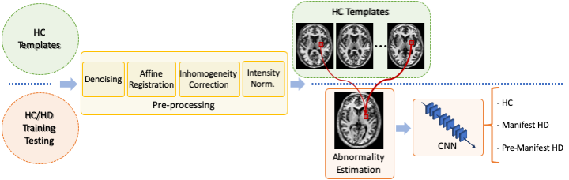
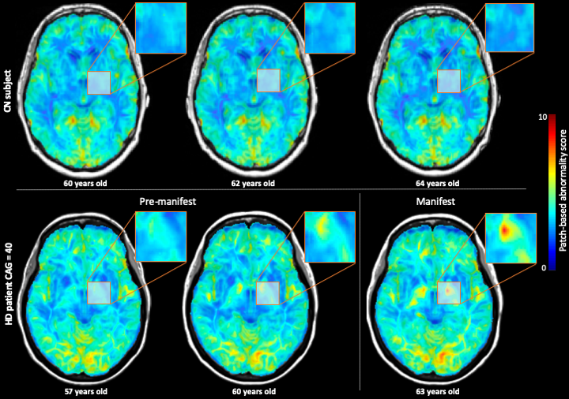
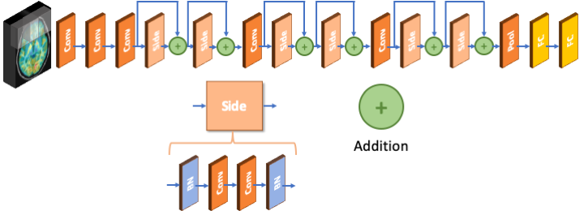

# Patch-based abnormality


<p>Implementation of <b>Hett et al., MICCAI, 2020</b> (see accepted paper <a href="https://github.com/hettk/patch-based_abnormality/raw/master/Local_dissimilarity_helps_deep_learning_for_the_classification_of_Huntington_disease.pdf">here</a>)</p>
<br>
<p>Please cite:</p>
<p>Hett, Kilian, et al. "Patch-based abnormality maps for improved deep learning-based classification of Huntington's disease." International Conference on Medical Image Computing and Computer-Assisted Intervention. Springer, Cham, 2020.</p>

```
@inproceedings{hett2020patch,
  title={Patch-based abnormality maps for improved deep learning-based classification of Huntington's disease},
  author={Hett, Kilian and Giraud, R\'emi and Johnson, Hans and Paulsen, Jane S. and Long, Jeffrey D.  and Oguz, Ipek and others},
  booktitle={International Conference on Medical Image Computing and Computer-Assisted Intervention},
  year={2020},
  organization={Springer}
}
```


### Summary
- PatchBasedAbnormality
    - main function : process_pba.m
    
```matlab
% [pbi,pbs] = process_pba(input, templates, options): Estimate
% abnormality map given a control subject population (see Hett et al.
% MICCAI 2020)
% 
% Arguments: 
%   - input
%       input.mri : path of the mri understudy
%       input.mask: mask of the region of interest
%       input.age : age of the subject understudy at scan
%   - templates
%       templates.t1_path  : list of path of the template mri
%       templates.mask_path: list of path of the template mask
%       templates.ages     : Vector of ages of templates at scan
%   - options 
%       OPAL parameters (default)
%       options.rss      = 8;    Size of the search area
%       options.ni       = 5;    Number of iter max
%       options.np       = 20;   Number of patch extracted
%       options.pr       = 3;    Patch size
%       options.hasmutex = 1;    Enable mutex 
%
% Return:
%   - pbi: abnormality map (patch distance in terms of intensity
%   differences)
%   - pbs: mean spatial distance map of patches extracted using OPAL
```
    
- DeepLearningClassification
    - main scripts: train.py, test.py


## Abstract
<p align="justify">Deep learning techniques have demonstrated state-of-the-art performances in many medical imaging applications. These methods can efficiently learn specific patterns. An alternative approach to deep learning is patch-based grading methods, which aim to detect local similarities and differences between groups of subjects. This latter approach usually requires less training data compared to deep learning techniques. In this work, we propose two major contributions: first, we combine patch-based and deep learning methods. Second, we propose to extend the patch-based grading method to a new patch-based abnormality metric. Our method enables us to detect localized structural abnormalities in a test image by comparison to a template library consisting of images from a variety of healthy controls.  We evaluate our method by comparing classification performance using different sets of features and models. Our experiments show that our novel patch-based abnormality metric increases deep learning performance from 91.3% to 95.8% of accuracy compared to standard deep learning approaches based on the MRI intensity.</p>

<br>

<p align="center"><br>
<i>Fig. 1 Pipeline of the proposed method. First, HC from the dataset is separated into two subset, the HC templates used to estimate the local abnormality, the second is the set of HC for the evaluation of our method. Once all MRIs are preprocessed, we estimate the local abnormality using the HC template library. Finally, a convolutional neural network with softmax is used to obtain final classification.</i></p>
<br>

## Patch-based abnormality index

<p align="justify">Our method derives from the patch-based grading framework [1,2]. To address PBG's dependence on the two template libraries, we estimate the local differences from a single template library composed only of HC subjects (see Fig 2). The abnormality a(x) for each voxel x of the MRI under study, is defined as:</p>
<p align="center"></p>
<p align="justify">where &sigma;<sub>S(x)</sub> is standard deviation of intensities over the patch S(x), which normalizes the differences of signal intensity contained in each patch S(x). K<sub>x</sub> is the set of closest patches provided by the PatchMatch algorithm [3].  This results in a low abnormality metric if the current patch is similar to age-matched control subjects, and in a high abnormality metric if the patch does not fit well within the distribution of age-matched control subjects. </p>
<br>

<p align="center"><br>
<i>Fig. 2 Illustration of patch-based abnormality maps for <b>Top</b> a healthy control subject and <b>Bottom</b> an HD patient with 40 CAG repeats. <b>From left to right</b>, 3 different time points are shown for each subject. The HD subject is in the pre-manifest stage for the first time points, but converts to clinical diagnosis by the third time point. <b>Blue</b> represents areas with a low abnormality score <i>a(x)</i>, whereas <b>Red</b> represents areas with high abnormality score <i>a(x)</i>. We note a progressive increase of abnormality near the basal ganglia during the course of the disease which is consistent with HD pathology, while the abnormality map for the HC subject remains stable.</i></p>

## Deep-learning classification

<p align="justify">In order to model the spatial disease signature and perform the subject-level classification, we used a convolutional neural network (CNN) approach. In recent years, many different architectures have been proposed in the pattern recognition field. Among them, deep residual neural network (ResNet) has shown competitive performances [4]. This architecture is characterized by skipped connections of different blocks of layers (see Fig 3). ResNet has demonstrated a reduced training error compared to other networks with similar depth. Indeed, the residual mapping enables to reduce the training error, which is generally correlated with the network depth for classic stacked architectures. In addition, to address the problem of GPU memory limitation, we used a 3D patch approach. Thus, both networks have as input 8 channels that represent non-overlapping patches from the input data (i.e., T1w MRI or PBA maps).</p>

<p align="center"><br>
<i>Fig. 3 Illustration of the convolutional neural network architecture used to validate our work. The architecture consist of a combination of convolutional layer (Conv), batch normalization (BN), Skipped connection layer (Side), pooling layer (Pool), and fully connected layer (FC). A softmax layer estimate the probability for each class.</i></p>


## References
[1] Coupé, Pierrick, et al. "Simultaneous segmentation and grading of anatomical structures for patient's classification: application to Alzheimer's disease." NeuroImage 59.4 (2012): 3736-3747.

[2] Hett, Kilian, et al. "Adaptive fusion of texture-based grading for Alzheimer's disease classification." Computerized Medical Imaging and Graphics 70 (2018): 8-16.

[3] Giraud, Rémi, et al. "An optimized patchmatch for multi-scale and multi-feature label fusion." NeuroImage 124 (2016): 770-782.

[4] He, Kaiming, et al. "Deep residual learning for image recognition." Proceedings of the IEEE conference on computer vision and pattern recognition. 2016.
